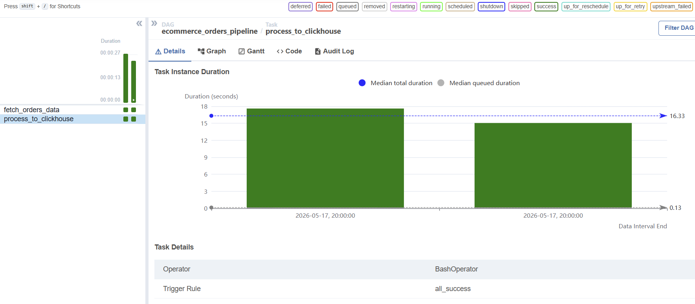

# 🛒 Building Market Basket Analysis Pipeline

> **Authors: MCI_Kelompok_20**
>
> 1. _Bima Novrifa Ananditya (5025241194)_
> 2. _Syah Amin Zikri (5025241197)_

Proyek ini mengekstrak data transaksi dari **http://96.9.212.102:8000/orders**, menemukan pola asosiasi produk menggunakan algoritma FP-Growth di PySpark MLlib, mengorkestrasinya via **Apache Airflow**, menyimpannya ke **ClickHouse**, dan memvisualisasikannya di **Metabase**, dimana semuanya dikemas dalam satu lingkungan Docker.

Arsitektur sistem ini mengadopsi pendekatan _Snapshot / Full Refresh_ untuk memastikan seluruh metrik analitik dan _dashboard_ selalu merepresentasikan kondisi data pesanan yang paling mutakhir.

---

## 🏗️ Arsitektur Sistem

```text
E-commerce API
   ↓ (100 pesanan terbaru / snapshot)
[Ingestion — Python requests]
   ↓ simpan latest_orders.parquet
[Data Lake — folder lokal]
   ↓ baca, flattening, & FP-Growth ML
[Processing — Apache Spark MLlib]
   ↓ truncate-insert (Full Refresh)
[Data Warehouse — ClickHouse]
   ↓ koneksi langsung
[Dashboard — Metabase]

↻ Seluruh siklus diatur oleh Apache Airflow
```

**Metrik yang dianalisis:**

- **Peak Order Times:** jam-jam tersibuk pelanggan melakukan checkout pesanan
- **Weekday vs Weekend Behavior:** perbandingan volume transaksi di hari kerja versus akhir pekan
- **Top Departments:** kategori departemen yang menyumbang volume penjualan terbesar
- **Most Reordered Products:** produk dengan tingkat repeat order paling tinggi
- **Customer Reorder Behavior:** seberapa lama jarak rata-rata hari pelanggan kembali berbelanja
- **Market Basket Analysis:** korelasi dan probabilitas antar produk yang sering dibeli secara bersamaan (berdasarkan nilai Lift & Confidence)

## 🛠️ Tech Stack

| Komponen       | Teknologi                         |
| -------------- | --------------------------------- |
| Orchestration  | Apache Airflow 2.9                |
| Processing     | Apache Spark / PySpark 3.5        |
| Data Warehouse | ClickHouse (column-oriented OLAP) |
| BI & Dashboard | Metabase                          |
| Infrastructure | Docker & Docker Compose           |
| Language       | Python 3.11                       |

## 📂 Struktur direktori

```

orders-pipeline/
│
├── dags/               # Folder utama Airflow
|    └── scripts/       # Kumpulan task script Python
│    |  ├── fetch_orders.py             # Ekstrasi: Narik data JSON dari API
│    |  └── process_orders_spark.py     # Transformation: PySpark & FP-Growth MLlib
|    └── orders_pipeline.py             # File DAG (Skenario penjadwalan/orkestrasi)
│
├── data_lake/          # Folder transit lokal (Storage)
│    └── order/         # Tempat nyimpen file temporary (latest_orders.parquet)
│
├── .gitignore          # File untuk mengecualikan data rahasia/sampah
├── docker-compose.yml  # Konfigurasi container (Airflow, ClickHouse, dll)
├── requirements.txt    # Dependencies (pyspark, clickhouse-driver, pandas)
└── README.md           # Dokumentasi project

```

## 🚀 Tutorial Penggunaan

Ikuti langkah-langkah di bawah ini untuk mengkloning repositori, menyiapkan lingkungan Docker, hingga menjalankan seluruh _pipeline_.

### 📋 Prasyarat (Prerequisites)

Pastikan perangkat lu sudah terinstal aplikasi berikut:

- [Git](https://git-scm.com/)
- [Docker Desktop](https://www.docker.com/products/docker-desktop/)

---

### Langkah-Langkah Eksekusi

#### 1. Kloning Repositori

Buka terminal di VS Code, lalu jalankan perintah berikut:

```bash
git clone https://github.com/Kifrx/MCI2026_Task2_Kelompok20.git

cd orders-pipeline
```

#### 2. Jalankan Docker

Build image, sebelum itu buka dahulu docker desktop.

```
docker-compose build
```

Instalasi database airflow

```
docker-compose up airflow-init
```

Jalankan seluruh pipeline

```
docker-compose up -d
```

> Tunggu 1–2 menit lalu buka http://localhost:8080

#### 3. Aktifkan Pipeline di Airflow

1. Buka http://localhost:8080 → login admin / admin
2. Temukan DAG wikipedia_realtime_stream, geser sakelar untuk mengaktifkan
3. Klik ▶️ Trigger DAG untuk memaksanya jalan sekarang


Gambar di atas menunjukkan bahwa task-task sukses dijalankan,


Gambar diatas menampikan tab Graph, dimana dua kotak di atas saling terhubung dengan garis biru yang merupakan representasi visual dari logika urutan code. Kotak kiri adalah tugas menyedot data (fetch_orders_data) dan kotak kanan adalah tugas mengolah data dengan Spark (process_to_clickhouse). Di dalam kedua kotak tersebut terdapat indikator kotak kecil berwarna hijau bertuliskan success. Ini membuktikan bahwa dependency (ketergantungan) dibuat berjalan lancar: Tugas 1 berhasil mencari data, lalu estafet diserahkan ke Tugas 2, dan Tugas 2 berhasil mengolah serta memasukkannya ke ClickHouse.
